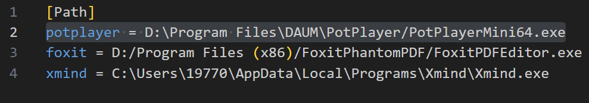

### 用Quicker设置Obsidian到PotPlayer的跳转、回链动作

用Quicker可以帮助我们完成一些繁琐的、需要多个操作步骤的动作。

这篇文章中，我用Quicker将的PotPlayer视频截图复制到到Obsidian文件夹、并制作回链且按照callout格式复制到Obsidian笔记中，使之点击Obsidian中的链接能自动打开PotPlayer，并跳转到视频的截图时间戳位置。

之前的三篇文章，我介绍了BookxNote、Zotero、Eagle中Quicker完成跳转链接的思路。它们三者的共同点是，在软件安装时，就已经在注册表中注册了相关的回链协议。

例如当链接为`eagle://`、`eagle://item/LUJ9441DVAFRL`，系统能识别并自动打开Eagle软件。前者代表只打开Eagle软件，后者带item参数，能打开Eagle软件同时跳转到对应的图片位置。BookxNote和Zotero同理。

但是PotPlayer安装时没有注册回链协议。

前几天，我在刷B站视频时，看到了大佬一鸣惊人_001的视频：[摘录视频、PDF、PPT到Obsidian和Excalidraw的配置教程 -- 一键摘录内容，点击回链跳回原文\_哔哩哔哩\_bilibili](https://www.bilibili.com/video/BV1qH4y1j7Q6/?spm_id_from=333.999.0.0)，里面详细介绍了生成摘录信息、处理摘录信息、响应回链三个部分。由于生成摘录信息和处理摘录信息我用Quicker替代了，因此大家只需要下载响应回链部分就可。这是大佬的github仓库地址[GitHub - Bowen-0x00/CustomProtocolHandler: CustomProtocolHandler是一个用于处理自定义协议的工具，旨在实现处理自定义协议链接回链。方便通过笔记软件进行知识管理。如点击自定义协议链接时能够跳回原位，包括但不限于视频、PPT和PDF。](https://github.com/Bowen-0x00/CustomProtocolHandler/releases)

大家下载好后config.conf里修改PotPlayer路径为你自己的安装路径（这里的路径一定是安装版PotPlayer的路径，便携版PotPlayer无法自动启动；但平时可用便携版PotPlayer进行摘录）。

修改路径：

然后右键以管理员身份运行“设置注册表.bat”，在电脑的注册表里添加自动以回链协议。在运行前，把这几个文件放在一个固定位置，移动过的话需要重新以管理员身份运行一下（我是小白，也不太清楚，一般不会出问题）。

PotPlayer的回链：`ymjr://open?app=potplayer&file=视频地址&seek=时间戳`，点击后就能打开PotPlayer、并且打开视频、并且跳到对应的时间戳，如果上一步响应回链部分配置没问题的话。而且如果**源视频的路径**移动过的话，也是无法打开视频的。

摘录PotPlayer图片到Obsidian中Markdown的样式：

摘录PotPlayer图片到到Obsidian中Excalidraw的样式：

点击Markdown或Excalidraw中的链接能跳转到PotPlayer视频对应时间：

制作Quicker动作前，需要设置复制视频路径的快捷键、复制当前时间戳的快捷键，可自定义，但需要与Quicker动作里相应的步骤一致。截取当前视频图片好像默认是ctrl+c，这个不用设置。

设置快捷键详情可以看大佬的视频：[摘录视频、PDF、PPT到Obsidian和Excalidraw的配置教程 -- 一键摘录内容，点击回链跳回原文\_哔哩哔哩\_bilibili](https://www.bilibili.com/video/BV1qH4y1j7Q6/?spm_id_from=333.999.0.0)

制作Quicker动作的思路：

使用的方法：选中标注的文字或框起来的图片，点击Quicker动作，到Obsidian里点击剪贴位置，然后按ctrl+v就可以了。我平时用Obsidian和Typora编辑文档，因此动作中加了识别Typora窗口的部分。

我将Quicker动作、不同的摘录情况的调试运行详情放到了[github仓库](https://github.com/operations4304/PotPlayer-Obsidian)

**但不幸的是，如果您直接用肯定是没法用的**。因为时间精力有限，没法做成普遍适用的动作。

所以这里提供的是实现的思路，以及可以参考的某些步骤的动作的写法。

如果你对图片的复制方式不清楚，可以查看这篇文章，[附件管理方式](https://zhuanlan.zhihu.com/p/690376509)，介绍了附加的储存情况。

谢谢观看！
